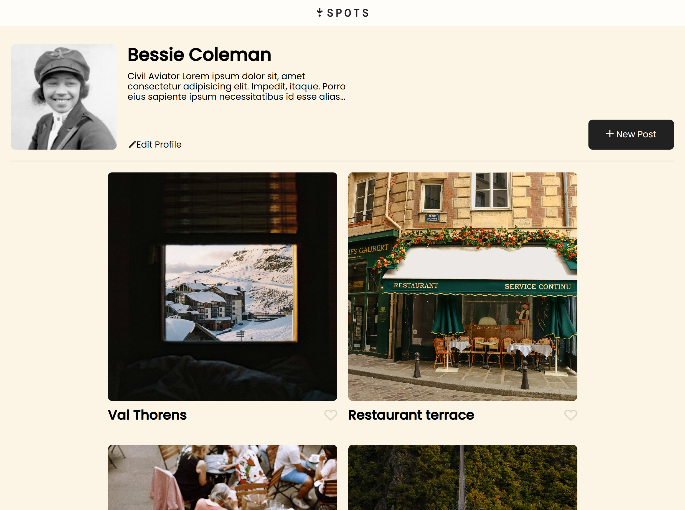

# Project 3: Spots

### Overview

This project was made to work very similer to other image sharing websites like instagram where you can post images and other users can view those images adn interact with them

### Tools Used

- Html
- CSS
- Responsive Design
- Figma

### Project links

- [Deployment link](https://chemai-dev.github.io/se_project_spots/)
- [Video Link](https://drive.google.com/file/d/1S9NVWoBsyj2I_Z9ewggP0sYOC5NmI3j6/view?usp=sharing)

### WIP

- heart icon clipping ouside of card container
